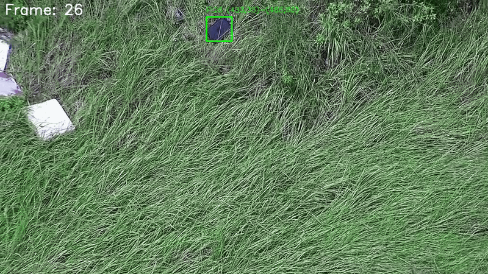

## Drone Tracker Overview

This folder bundles everything needed to reproduce the object-tracking pipeline used for the Kaggle/Colab experiments referenced in `note.txt`. The workflow combines Ultralytics MobileSAM for mask proposals, DINOv2-small embeddings for appearance matching, and `supervision`'s ByteTrack for temporal smoothing before exporting Kaggle-ready JSON.

## Layout

- `trainv1.py` – end-to-end pipeline that loads checkpoints, extracts template embeddings from reference crops, runs MobileSAM detections on video frames, filters masks, matches them to the template embedding, and emits interpolated bounding boxes per frame.
- `kaggle.ipynb` / `colab.ipynb` / `sam.ipynb` – notebooks used for exploratory experiments and remote execution (Kaggle, Colab, local SAM tweaks).
- `dataset/` – expected input structure (`train/` and `public_test/`, each containing folders with `drone_video.mp4` and `object_images/*.jpg`).
- `checkpoints/` – pretrained weights such as `FastSAM-s.pt` or `mobile_sam.pt`.
- `ml-mobileclip/`, `open_clip/` – vendor code for CLIP-style models; required only if you plan to fine-tune or swap encoders.
- `note.txt` – links to the Kaggle and Colab notebooks that produced competition submissions.

## Fetching MobileCLIP & OpenCLIP

Clone the upstream repositories into this folder so that `trainv1.py` can reuse their encoders or training utilities:

```bash
cd /datastore/inseclab/phong/idrone
git clone https://github.com/apple/ml-mobileclip.git ml-mobileclip
git clone https://github.com/mlfoundations/open_clip.git open_clip
```

The Apple team’s repository documents additional setup (pretrained checkpoints, evaluation scripts, licensing) in detail; refer to their README if you plan to fine-tune MobileCLIP / MobileCLIP2 variants [https://github.com/apple/ml-mobileclip](https://github.com/apple/ml-mobileclip).

## Pipeline Details (`trainv1.py`)

1. **Model loading**  
   - Ultralytics `SAM("mobile_sam.pt")` for segmentation proposals.  
   - Hugging Face `facebook/dinov2-small` encoder (`AutoImageProcessor` + `AutoModel`) on CUDA, inference-mode, mixed precision (`torch.autocast`) for embeddings.

2. **Template building** (`get_template`)  
   - For each reference image, MobileSAM proposes masks; the highest-scoring (or largest) mask is converted to a padded crop.  
   - Crops are resized to 224×224, embedded via DINOv2, averaged, and L2-normalized to form the reference vector.

3. **Video processing** (`process_video`)  
   - Opens `drone_video.mp4`, instantiates a per-video ByteTrack tracker (supervision).  
   - Every other frame triggers SAM inference; masks are pruned by pixel count, bounding-box size, and capped to the top 24 candidates.  
   - Remaining crops are embedded and cosine-similarity compared to the template; detections >0.8 score seed/update ByteTrack.  
   - Frames without fresh detections reuse the last bounding box; gaps are later filled via linear interpolation so every frame has a box.

4. **Output**  
   - Returns `{"video_id": ..., "detections": [{"bboxes": [...] }]}` where each bbox entry stores frame index and `x1,y1,x2,y2`.

## Running the Script

```bash
cd /datastore/inseclab/phong/idrone
python trainv1.py --data_dir dataset/public_test --output submission.json
```

Requirements (install via pip/conda as needed):

- `torch` with CUDA, `opencv-python`, `tqdm`
- `ultralytics`, `transformers`, `supervision`, `numpy`

Ensure GPU availability and place `mobile_sam.pt` (and any other checkpoints) in `checkpoints/` or provide an absolute path when constructing `SAM`.

## Extending / Customizing

- **Thresholds** – adjust `min_pixels`, `max_pixels`, bbox size ratios, and similarity cutoffs near the middle of `process_video` to balance recall vs. precision.  
- **Tracking cadence** – modify `skip_counter` logic if you need denser SAM inference or a different stride.  
- **Embedders** – to experiment with MobileCLIP or custom encoders, point `batch_embed` to the code inside `ml-mobileclip/` or `open_clip/`.

## Notebooks

Use `kaggle.ipynb` or `colab.ipynb` when you need hosted GPUs. The links in `note.txt` open ready-to-run environments that mirror the script here; keep the directory layout consistent before exporting results.

## Tips

- Keep reference images tightly cropped—`get_template` already pads and centers the masks, but garbage inputs lead to weak embeddings.  
- If SAM occasionally misses the drone, decrease the skip stride and loosen `max_bbox_*` ratios, at the cost of more false positives.  
- Monitor VRAM usage when batching crops; `batch_embed` already handles empty lists, so you can safely adjust the frame sampling window if memory gets tight.

## Demo



The animation above is rendered directly from the JSON output produced by `trainv1.py`. Each frame shows the MobileSAM mask proposal overlaid with the ByteTrack-stabilized bounding box that survives the cosine-similarity filter against the DINOv2 template. Notice how the box stays locked on the drone even when the per-frame detector briefly drops, thanks to the interpolation and tracker smoothing logic described earlier.

